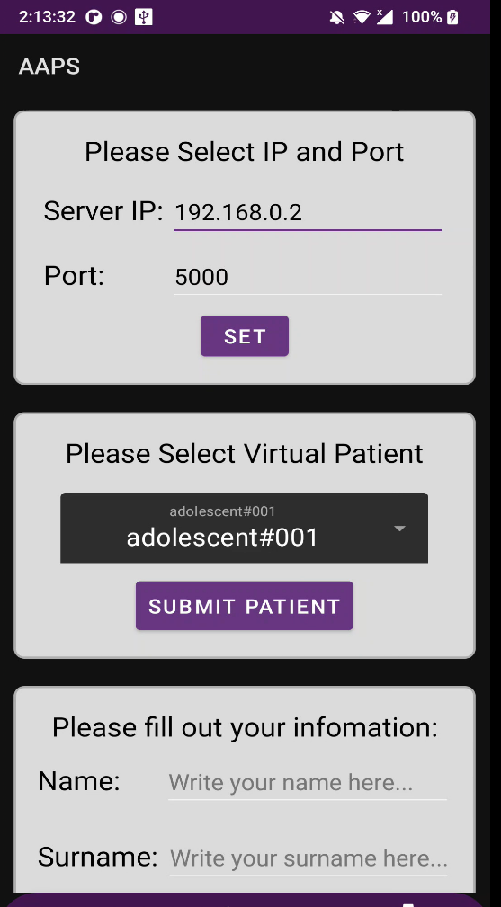

# AAPS

This is a simulator for multiple virtual type 1 diabetes patients, also included are artificial neural networks for glucose prediction and insulin dosage calculation. In this project is also included multiple script that allow the training for new models for glucose prediciton and insulin calculation. The script to tranform them into a tflite file so that they can be read into the android application. The REST API for tranfering and training models between the computer and the Android application is also included.

## Installation

Details about how to install

   1. Create a Python virtual environment: `python3 -m venv <env_name>`
   2. Activate the environment: 
      For windows, run: `<env_name>\Scripts\activate`
      For Unix or MacOS, run: `source <env_name>/bin/activate`
   3. Install the requirements : `pip install -r requirements.txt`

## Usage

### Generate New Virtual Patient Data
1. In the python file `generatePatients.py` change the options list to include all the patients you want to generate new data for.
2. Change the Days and time parameters to change for how long the generated data will be for
3. Run the script

The generated data will be in the folder `PatientData\patient_Dexcom_Insulet_patientData.json`

The options list can Include these patients: 
`options=[adolescent#001,adolescent#002,adolescent#003,adolescent#004,adolescent#005,adolescent#006,adolescent#007,adolescent#008,adolescent#009,adolescent#010,adult#001,adult#002,adult#003,adult#004,adult#005,adult#006,adult#007,adult#008,adult#009,adult#010,child#001,child#002,child#003,child#004,child#005,child#006,child#007,child#008,child#009,child#010]`

### Train a new model for glucose prediction for a patient

1. Generate new data using the script `generatePatients.py`
2. In the script `TrainGlucoseModels.py` change the parameters `patient_name="<Patient name you want to train for>"` `epochs= epochs you want to train for`
3. Run the script `TrainGlucoseModels.py`

### Train a new model for Insulin prediction for a patient

1. In the file `TrainInsulinModels.py` Change the list parameter `patients=[]` to include all the patients you want your model to train for
2. Run the script `TrainInsulinModels.py`

The available patients are the one available for options parameters mentioned in `Generate New Virtual Patient Data`

### Export the glucose model to tflite
   1. Run the script `tfliteGlucoseModelExporter_pretrained.py` and pass as argument the patient name e.g  `tfliteGlucoseModelExporter_pretrained.py adult#002`

### Export the glucose model to tflite
   1. Run the script `tfliteGlucoseModelExporter_pretrained.py` and pass as argument the patient name e.g  `tfliteGlucoseModelExporter_pretrained.py adult#002`
   
### Export the Insulin model to tflite
   1. Run the script `tfliteInsulinModelExporter_pretrained.py` and pass as argument the patient name e.g  `tfliteInsulinModelExporter_pretrained.py adult#002`

### Run the application
   1. Download and Install the apk file on android device
   2. Run the the REST API `rest_api.py IP PORT` e.g `rest_api.py 192.168.0.2 5000`
   3. In the application provide the selected IP and Port
   
   

### Load the pre-trained models on the application
   1. After running the application select the patient you want to load from the Settings Tab
   2. In the Form Tab Press the Get PRE-TRAINED MODEL

### Train on data that we got on the android application
   1. Connect with the API
   2. Send the gathered data by pressing the Button SEND PATIENT DATA
   4. Train the model by running `run.py <patient_data_file_name> <epochs>`
   3. To get the Model Press GET MODEL after training is completed

## License

This project was completed by Antreana Christoforidi, Charalambos Rotsides, Constantinos Palochis, Maria Ashikali, and Theofanis Lymbouris as part of our final thesis for our Computer Engineering Degree. 
